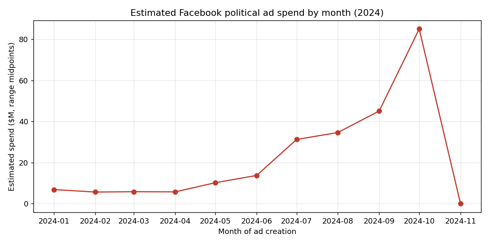
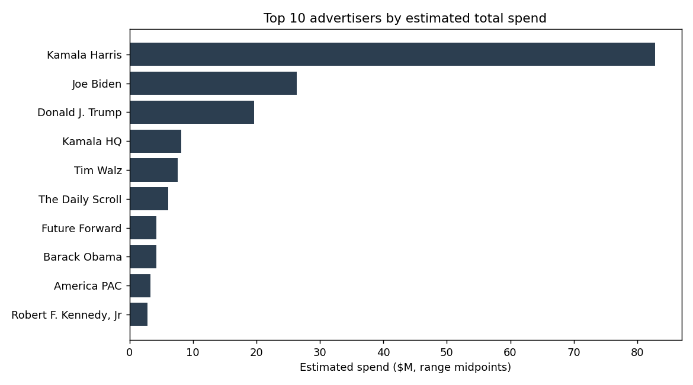
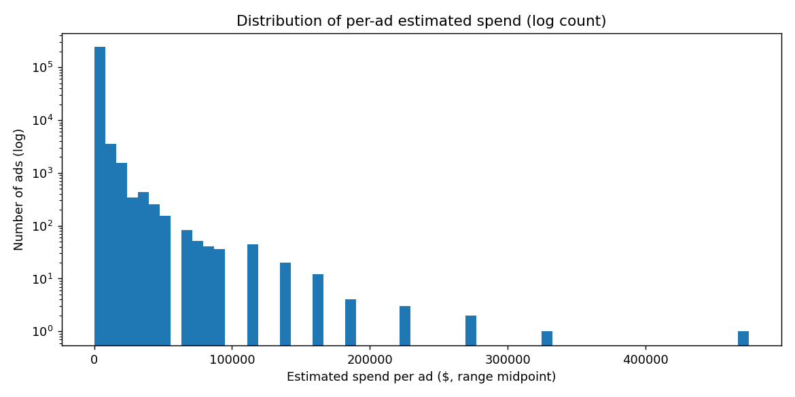

# Task_01_Descriptive_Stats

Descriptive statistics for a real-world political advertising dataset, computed
two independent ways: once with **only the Python standard library**, and once
with **pandas**. The two scripts are built to arrive at the same statistical
truths through different means, and the comparison between them is the point of
the exercise.

The data is ~247,000 Facebook ad purchases from the 2024 U.S. Presidential
election, where each ad mentions one or more presidential candidates.

## What's in here

| File | What it does |
|------|--------------|
| `pure_python_stats.py` | Full descriptive statistics using only `csv`, `math`, `collections`, etc. No third-party packages. |
| `pandas_stats.py` | The equivalent analysis in pandas, structured to mirror the pure-Python output. |
| `visualize.py` | (Bonus) Generates the four charts in `images/`. |
| `requirements.txt` | Dependencies for the pandas and visualization scripts only. |
| `FINDINGS.md` | 1–2 page narrative of what the data actually shows. |
| `COMPARISON.md` | Reflection on where the two approaches diverge and why. |
| `images/` | Generated charts. |

## Getting the data

The dataset is **not** included in this repository (it is large, and the task
asks that it be kept out of version control).

1. Download `fb_ads_president_scored_anon.csv` from the source:
   **2024 Facebook Political Ads** —
   <https://drive.google.com/drive/folders/1e9FnDRyA-MWt_wLQHCctS5Dw60iC87oW?usp=sharing>
2. Place it anywhere you like. The scripts accept the path as an argument, so
   nothing is hardcoded. The simplest option is to drop it in the repo root,
   where it becomes the default (`.gitignore` already excludes it).

## How to run

Python 3.9+ recommended.

### Pure-Python script (no install needed)

```bash
python pure_python_stats.py /path/to/fb_ads_president_scored_anon.csv
# or, if the CSV is in the repo root:
python pure_python_stats.py
```

### Pandas script

```bash
pip install -r requirements.txt
python pandas_stats.py /path/to/fb_ads_president_scored_anon.csv
```

### Charts (bonus)

```bash
python visualize.py /path/to/fb_ads_president_scored_anon.csv
# writes PNGs into images/
```

Both stats scripts also accept an optional `--group-by COLUMN` flag to print an
extra value-count table, e.g. `--group-by page_name`.

## The dataset at a glance

- **246,745 rows × 40 columns.** Every `ad_id` is unique, so one row = one ad.
- **Three "numeric-looking" columns are actually ranges.** `spend`,
  `impressions`, and `estimated_audience_size` are stored as dict-like strings
  such as `{'lower_bound': '200', 'upper_bound': '299'}`. Both stats scripts
  correctly report these as **strings**, because that is what they are. Any
  dollar analysis (in `FINDINGS.md` and `visualize.py`) collapses each range to
  its midpoint, which is a documented modeling choice.
- **Two more columns are lists-as-strings:** `illuminating_mentions` (candidate
  names) and `publisher_platforms`.
- **26 genuine numeric columns**: a set of 0/1 indicator flags produced by an
  automated message classifier (`illuminating_*`) for message type, call-to-
  action, topic, incivility, and scam.
- **Missingness is low:** only `ad_delivery_stop_time` (0.87%), `bylines`
  (0.41%), and `estimated_audience_size` (0.23%) have any gaps.

## Summary of findings

Full narrative in [`FINDINGS.md`](FINDINGS.md). The headline results:

- Spending is **highly concentrated**. The single largest advertiser
  (the Kamala Harris page) accounts for a very large share of all estimated
  spend, and the top handful of pages dominate the total.
- Spending **ramps steeply toward Election Day**: estimated monthly spend rises
  from single-digit millions early in 2024 to roughly ten times that by
  October, before dropping to essentially nothing in November (the election was
  Nov 5).
- **Donald Trump is the most-mentioned figure** across ads, appearing in more
  ads than any other candidate, including in ads not run by his own campaign.
- The most common **issue topics** are the economy, health, and social/cultural
  issues; niche topics like technology/privacy and military appear in well under
  1% of ads.






## Comparison of the two approaches

Full write-up in [`COMPARISON.md`](COMPARISON.md). In short: the numeric results
agree to the displayed precision because both use the sample standard deviation
(n−1) and both skip missing values. The differences are all about *who makes the
decision*. Pandas silently decided what counts as `NaN`, which columns are
numeric, and how to sort ties; the pure-Python version had to make every one of
those calls in code, which is exactly why writing it teaches you more about the
data than `DataFrame.describe()` ever will.

## Reproducibility notes

- No hardcoded paths; the input file is a command-line argument.
- The pure-Python script has zero dependencies. The pandas/plot scripts pin
  minimum versions in `requirements.txt`.
- Standard deviation is the **sample** std (n−1) in both scripts, matching
  pandas' and R's defaults.
