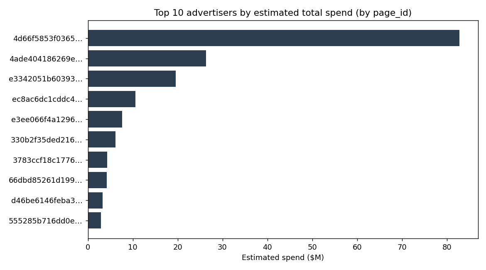
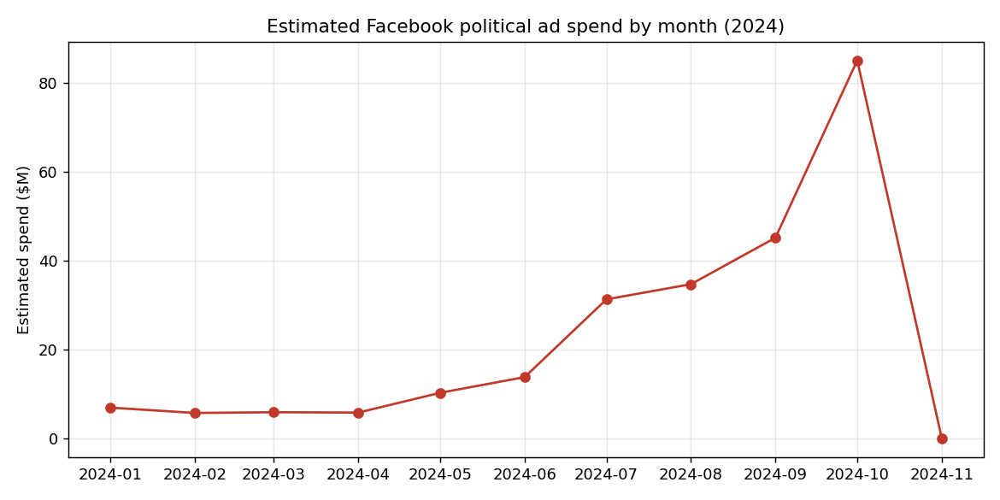
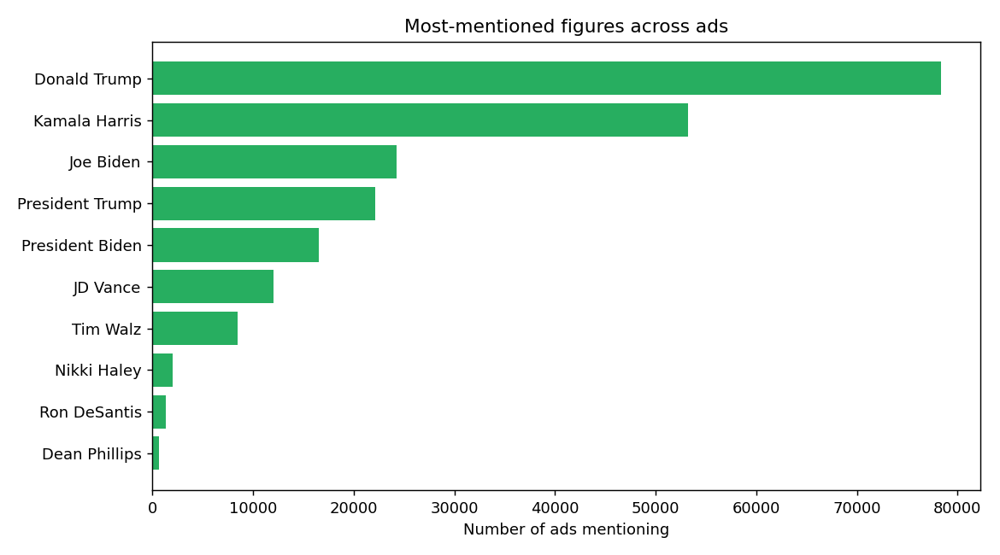

# Task_02_Descriptive_Stats (Milestone A)

Descriptive statistics on the 2024 Facebook political-ads dataset
(`2024_fb_ads_president_scored_anon.csv`), computed **three independent ways** —
pure Python, Pandas, and Polars — at both the dataset level and at **grouped**
levels (by `page_id`, and by `page_id` + `ad_id`). The three implementations are
engineered to produce **identical numbers**; the reflection on *why that takes
work* is in [`REFLECTION.md`](REFLECTION.md).

> **This is a different file from Task 1.** Same subject, different schema:
> columns are renamed (`estimated_spend`/`estimated_impressions` instead of
> `spend`/`impressions`; the classifier flags are suffixed `*_illuminating`),
> there is **no `page_name`** (pages appear only as hashed `page_id`), and there
> are two new nested-dict columns (`delivery_by_region`,
> `demographic_distribution`). Notably, `estimated_spend` here is a **plain
> integer**, not the range-dict Task 1 used — so no midpoint reconstruction is
> needed for spend on this file. The scripts detect all of this dynamically and
> run unmodified.

## Architecture

The three scripts share one standard-library-only module, `datakit.py`, which
owns every *decision* that must be identical across implementations:

- what counts as **missing**;
- what counts as **numeric** — an all-or-nothing rule applied identically, so we
  never depend on each library's own (differing) type inference;
- which columns are **complex** and how to clean them. On this file that means
  the two list columns (`publisher_platforms`, `illuminating_mentions`) get
  element-count companions (`*__n_items`); the two nested-dict columns
  (`delivery_by_region`, `demographic_distribution`) are recognized as complex
  and reported as categorical rather than force-parsed. (The range-dict ->
  midpoint path still exists for files like Task 1's, and simply doesn't trigger
  here.)
- **data-aware group-key selection** for unknown schemas.

Pandas and Polars import the same `datakit`, then execute those decisions with
their own machinery. That shared layer is why the three agree and why these same
scripts carry directly into Milestone B.

```
datakit.py            shared, stdlib-only detection + cleaning
pure_python_stats.py  stdlib only
pandas_stats.py       Pandas
polars_stats.py       Polars
benchmark.py          bonus: times the three approaches
visualize.py          bonus: charts -> images/
```

## Getting the data

The dataset is **not** committed (large; and the task requires keeping it out of
version control). Download `2024_fb_ads_president_scored_anon.csv` from the
task's Google Drive link and pass its path to each script.

## How to run

Python 3.9+.

```bash
# 1. Pure Python -- no dependencies
python pure_python_stats.py /path/to/2024_fb_ads_president_scored_anon.csv

# 2. Pandas
pip install -r requirements.txt
python pandas_stats.py /path/to/2024_fb_ads_president_scored_anon.csv

# 3. Polars
python polars_stats.py /path/to/2024_fb_ads_president_scored_anon.csv
```

Groupings are auto-selected (`page_id`, then `page_id ad_id`); override with the
repeatable `--group-by` flag. Bonus:

```bash
python benchmark.py /path/to/ads.csv --repeat 3
python visualize.py /path/to/ads.csv     # writes images/
```

## Verifying the three agree

Checked programmatically on the full file: all **33 numeric columns** match
between pure Python and Pandas, with **exact agreement on every count** and a
maximum absolute difference of **6.8e-08** across mean/std/median (floating-point
noise on a standard deviation of ~137,000). Standard deviation is the **sample**
std (n-1) in all three implementations.

## Findings

- **Total estimated spend is about $261.9M** across 246,745 ads. Spending is
  extremely concentrated: grouped by `page_id`, the single largest page accounts
  for ~$82.8M -- roughly a third of everything -- and the next two pages add
  ~$26.4M and ~$19.6M. A handful of pages dominate; the rest is a long tail.
- **Per-ad spend is heavily right-skewed:** median **$49** against a mean of
  **$1,061** and a max of **$474,999** -- many tiny ads, a few enormous ones.
- **Spending is a countdown to Election Day.** Monthly estimated spend climbs
  from ~$6-7M early in 2024 to **~$85M in October**, then drops to essentially
  zero in November (the election was Nov 5).
- **Trump dominates mentions.** Across ads, Donald Trump is named most often
  (~78k ads; +22k as "President Trump"), ahead of Kamala Harris (~53k) and Joe
  Biden (~24k) -- and mentions don't track spend, since the top-spending pages
  are Democratic, which means many Trump mentions come from opposition/issue ads.
- **The `page_id` + `ad_id` grouping is deliberately near-degenerate** (every
  `ad_id` is unique -> 246,745 groups of one). That's itself a finding: for this
  file the analytically useful grouping is `page_id` alone.





## Comparison of the three approaches

Short version (full version in [`REFLECTION.md`](REFLECTION.md)): pure Python
forces you to author every decision and is the best *teacher*; Pandas is the most
convenient to reach for; Polars' strict typing and expression API catch mistakes
early and make grouped aggregation read cleanly. On wall-clock, parsing this
large CSV dominates, so the pure-Python vs. Pandas gap is smaller than the
"Pandas is faster" intuition suggests -- a reminder to measure, not assume.

## Reproducibility

- No hardcoded paths; input file is a CLI argument.
- Pure-Python script has zero dependencies; others pinned in `requirements.txt`.
- Sample std (n-1) everywhere; shared null tokens; one shared numeric rule.
